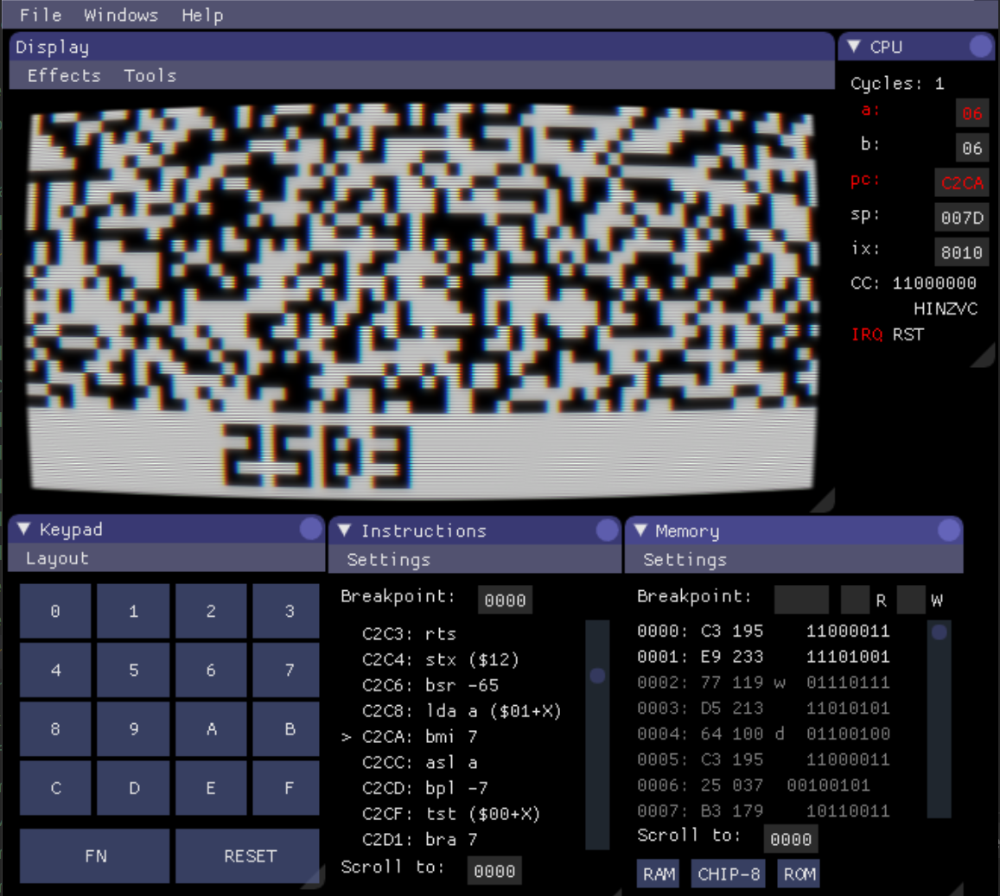

Daterad Rekreationell Övnings-Mikrodator
========================================

DRÖM ("DREAM" in Swedish) is an emulator for the CHIP-8-based DREAM 6800 home computer, powered by [LÖVE](https://love2d.org) and [Moon6800](https://github.com/tobiasvl/moon6800).

You can read about the development of DRÖM in [these blog posts](https://tobiasvl.github.io/tags/#dream-6800), and about the DREAM's history on the official [DREAM 6800 Archive Site](http://www.mjbauer.biz/DREAM6800.htm).

Features
--------

* Faithful emulation of the DREAM
* 4K of RAM
* Can quickload and play CHIP-8 games
* Includes software:
  * Michael J. Bauer's original CHIPOS monitor program
  * Michael J. Bauer's DREAM INVADERS game
* A comprehensive debug interface, powered by [love-imgui](https://github.com/slages/love-imgui)
* CRT shaders!

A very special thanks to Michael J. Bauer who permitted me to include the original software.

Memory map
----------

| Address range  | Contents       |
|----------------|----------------|
| `0000` - `03FF`| RAM            |
| `8010` - `8011`| PIA A (keypad) |
| `8012` - `8013`| PIA B (speaker & cassette) |
| `C000` - `C3FF`| EPROM          |
| `C400` - `FFFF`| Mirrored EPROM |

CHIPOS
------

When CHIPOS starts up, it will display an address at the bottom of the screen.

First, type a 4-digit hexadecimal number to enter a memory address.

Then execute one of the following commands:

* FN, 0: MEMOD (MEMory MODify): The contents of the address will be displayed as a 2-digit hexadecimal number. Type a new 2-digit number to replace the memory contents. The memory address will automatically advance by one. You can also press FN to advance one byte without modifying anyting.
* FN, 3: Run: Executes a program starting at the current address. To run a CHIP-8 program (which is loaded at address `0200`), run the CHIP-8 interpreter at `C000`.

Loading (FN, 1) and dumping (FN, 2) cassettes isn't supported yet, but instead you can use the "File" menu to quickload CHIP-8 games or DREAM INVADERS.

At any time, press RESET to return to the monitor program.

History
-------

The DREAM 6800 (Domestic Recreational Educational and Adaptive Microcomputer) was a Motorola 6800-based microcomputer created by Michael J. Bauer. Its construction was detailed in _Electronics Australia_ in 1979, and it included a monitor program called CHIPOS (Compact Hexadecimal Interpretive Programming and Operating System) and a CHIP-8 interpreter.

It had its own newsletter, [DREAMER](https://archive.org/search.php?query=creator%3A%22N.S.W.+6800+Users+Group%22), published between 1980 and 1982.

You can read more about the DREAM's history on Michael's official [DREAM 6800 Archive Site](http://www.mjbauer.biz/DREAM6800.htm).
